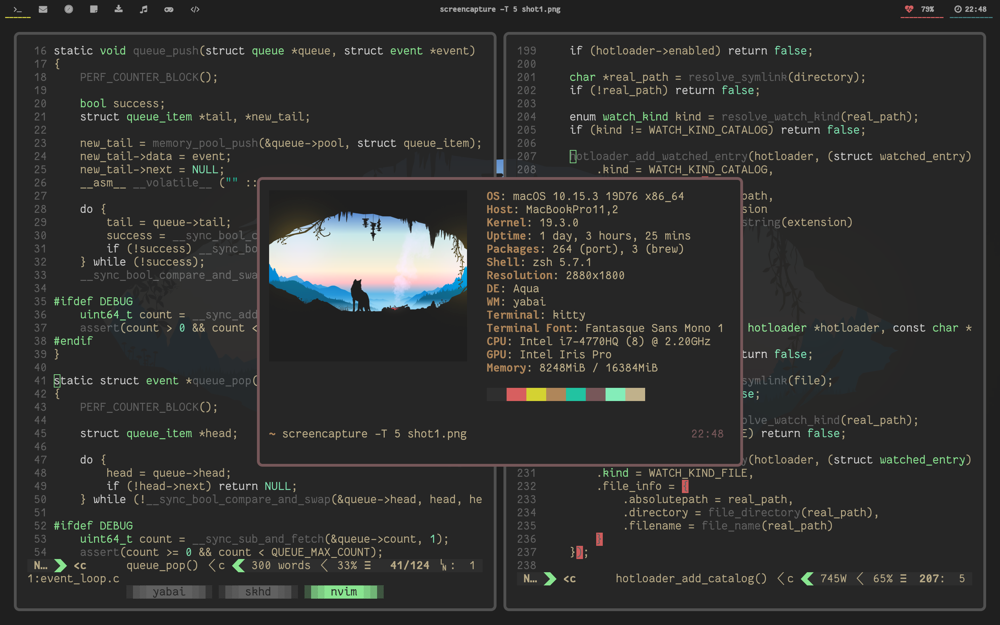

[](https://travis-ci.org/koekeishiya/yabai)



**yabai** started as a C99 rewrite of [*chunkwm*](https://github.com/koekeishiya/chunkwm), originally supposed to be its first RC version.

However due to major architectural changes, supported systems, and changes to functionality, it is being released separately.
There are multiple reasons behind these changes, based on the experience I've gained through experimenting with, designing, and using both *kwm*
and *chunkwm*. Some of these changes are performance related while other changes have been made to keep the user experience simple and more complete,
attempts to achieve a seamless integration with the operating system (when possible), proper error reporting, and yet still keep the property of being
customizable.

### Requirements

**yabai** is officially supported on **macOS High Sierra 10.13.6** and **macOS Mojave 10.14.4-6**. It uses a *scripting-addition*, which is a bundle of code
that we inject into *Dock.app* to elevate our privileges when communicating with the *WindowServer*. The *WindowServer* is a single point of contact for all applications.
It is central to the implementation of the GUI frameworks and many other services. Because of this, [*System Integrity Protection*](https://support.apple.com/en-us/HT204899) must be disabled for **yabai** to function properly.

**yabai** must be given permission to utilize the *Accessibility API*, and will request access upon launch. The application must be restarted after access has been granted.
If you are building from source or using the *brew --HEAD option*, it is recommended to first [*codesign*](https://github.com/koekeishiya/yabai/blob/master/CODESIGN.md) the binary such that access can persist through builds/updates.
You can read more about codesigning [here](https://developer.apple.com/library/archive/documentation/Security/Conceptual/CodeSigningGuide/Procedures/Procedures.html#//apple_ref/doc/uid/TP40005929-CH4-SW2).

The *Mission Control* setting [*displays have separate spaces*](https://support.apple.com/library/content/dam/edam/applecare/images/en_US/osx/separate_spaces.png) must be enabled.

**yabai** stores a lock file at `/tmp/yabai_$USER.lock` to keep multiple instances from launching by the same user.

**yabai** stores a unix domain socket at `/tmp/yabai_$USER.socket` to listen for messages.

**DISCLAIMER:** Use at your own discretion. I take no responsibility if anything should happen to your machine while trying to install, test or otherwise use this software in any form.
You acknowledge that you understand the potential risk that may come from disabling [*System Integrity Protection*](https://support.apple.com/en-us/HT204899) on your system, and I make
no recommendation as to whether you should or should not disable SIP.

### Install

Requires xcode-10 command-line tools.

**Homebrew**:

```
# clone tap
brew tap koekeishiya/formulae

# install latest stable version
brew install yabai

# install from git master branch
brew install --HEAD yabai
```

**Source**:

```
# clone repo and build binary
git clone https://github.com/koekeishiya/yabai
make install      # release version
make              # debug version

# symlink binary to a location in $PATH
ln -s $PWD/bin/yabai /usr/local/bin/yabai

# symlink manpage
ln -s $PWD/doc/yabai.1 /usr/local/share/man/man1/yabai.1
```

**Install scripting-addition**:

```
sudo yabai --install-sa
```

### Uninstall

**yabai** is a single binary application and is trivial to uninstall.

**Uninstall scripting-addition**:

```
sudo yabai --uninstall-sa
```

**Remove config and tmp files**:

```
rm ~/.yabairc
rm /tmp/yabai_$USER.lock
rm /tmp/yabai_$USER.socket
rm /tmp/yabai-sa_$USER.socket
```

**Homebrew**:

```
# if you were using brew services to manage yabai
brew services stop yabai
rm -rf /usr/local/var/log/yabai

# uninstall binary, manpage and plist
brew uninstall yabai
```

**Source**:

```
# remove binary symlink
rm /usr/local/bin/yabai

# remove manpage symlink
rm /usr/local/share/man/man1/yabai.1

remove the cloned git-repository..
```

### Configuration

The default configuration file is a shell-script located at one of the following places (in order):

 - `$XDG_CONFIG_HOME/yabai/yabairc`
 - `$HOME/.config/yabai/yabairc`
 - `$HOME/.yabairc`

A different location can be specified with the *--config | -c* argument. The configuration file consists of commands that
send messages to the running **yabai** instance. To send a message, invoke **yabai** with the *--message | -m* argument.

Keyboard shortcuts can be defined with [*skhd*](https://github.com/koekeishiya/skhd) or any other suitable software you may prefer.

Sample configuration files can be found in the [examples](https://github.com/koekeishiya/yabai/tree/master/examples) directory.

Refer to the [*documentation*](https://github.com/koekeishiya/yabai/blob/master/doc/yabai.asciidoc) for further information.
