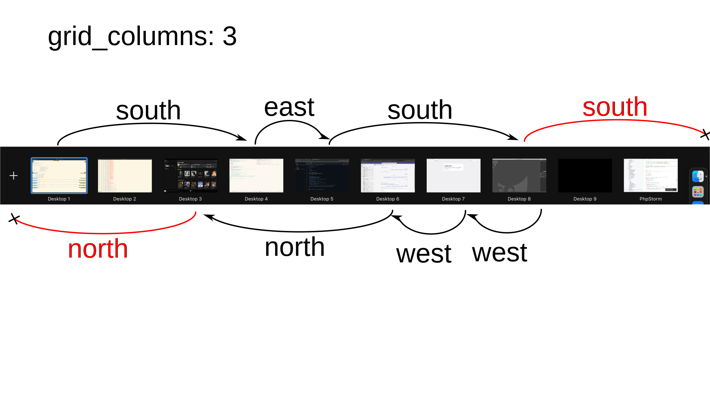

# yabai grid spaces

Grid space navigation in [yabai](https://github.com/koekeishiya/yabai).

## Installation

Install <https://github.com/mikkelricky/yabai/tree/grid-spaces> by running

```shell
brew install --HEAD mikkelricky/formulae/myabai
```

## Configuration

```shell
# Navigate a grid with 3 columns.
yabai --message config grid_columns 3
```



## Usage

|Requirement|Note|
|-:|:-|
|Operating&nbsp;System&nbsp;Intel x86-64|Big Sur 11.0.0+, Monterey 12.0.0+, Ventura 13.0.0+, Sonoma 14.0.0+, and Sequoia 15.0+ is supported.|
|Operating&nbsp;System&nbsp;Apple Silicon|Monterey 12.0.0+, Ventura 13.0.0+, Sonoma 14.0.0+, and Sequoia 15.0+ is supported.|
|Accessibility&nbsp;API|yabai must be given permission to utilize the Accessibility API and will request access upon launch. The application must be restarted after access has been granted.|
|Screen Recording|yabai must be given Screen Recording permission if and only if you want to enable window animations, and will request access when necessary. The application must be restarted after access has been granted.|
|System&nbsp;Preferences&nbsp;(macOS 11.x, 12.x)|In the Mission Control pane, the setting "Displays have separate Spaces" must be enabled.|
|System&nbsp;Settings&nbsp;(macOS 13.x, 14.x, 15.x)|In the Desktop & Dock tab, inside the Mission Control pane, the setting "Displays have separate Spaces" must be enabled.|

Please also take note of the following caveats.

|Caveat|Note|
|-:|:-|
|System&nbsp;Integrity&nbsp;Protection (Optional)|System Integrity Protection can be (partially) disabled for yabai to inject a scripting addition into Dock.app for controlling windows with functions that require elevated privileges. This enables control of the window server, which is the sole owner of all window connections, and enables additional features of yabai.|
|Code&nbsp;Signing|When building from source (or installing from HEAD), it is necessary to codesign the binary so it retains its accessibility and automation privileges when updated or rebuilt.|
|Finder&nbsp;Desktop|Some people disable the Finder Desktop window using an undocumented defaults write command. This breaks focusing of empty spaces and should be avoided when using yabai. To re-activate the Finder Desktop, run: "defaults write com.apple.finder CreateDesktop -bool true".|
|NSDocument-based&nbsp;Applications|Windows that utilize native macOS tabs such as Terminal and Finder, [do not behave correctly when creating tabs](https://github.com/koekeishiya/yabai/issues/68). Avoid creating tabs in these applications, consider alternatives that do not use NSDocument's tab system, or make these windows float using rules.|
|System&nbsp;Preferences&nbsp;(macOS 11.x, 12.x)|In the Mission Control pane, the setting "Automatically rearrange Spaces based on most recent use" should be disabled for commands that rely on the ordering of spaces to work reliably.|
|System&nbsp;Settings&nbsp;(macOS 13.x, 14.x, 15.x)|In the Desktop & Dock tab, inside the Mission Control pane, the setting "Automatically rearrange Spaces based on most recent use" should be disabled for commands that rely on the ordering of spaces to work reliably.|
|System&nbsp;Settings&nbsp;(macOS 14.x, 15.x)|In the Desktop & Dock tab, inside the Desktop & Stage Manager pane, the setting "Show Items On Desktop" should be enabled for display and space focus commands to work reliably in multi-display configurations.|
|System&nbsp;Settings&nbsp;(macOS 14.x, 15.x)|In the Desktop & Dock tab, inside the Desktop & Stage Manager pane, the setting "Click wallpaper to reveal Desktop" should be set to "Only in Stage Manager" for display and space focus commands to work reliably.|

## License and Attribution

yabai is licensed under the [&nearr;&nbsp;MIT&nbsp;License][yabai-license], a short and simple permissive license with conditions only requiring preservation of copyright and license notices.
Licensed works, modifications, and larger works may be distributed under different terms and without source code.

Thanks to [@fools-mate][gh-fools-mate] for creating a logo and banner for this project and making them available for free.

Thanks to [@dominiklohmann][gh-dominiklohmann] for contributing great documentation, support, and more, for free.

## Disclaimer

Use at your own discretion.
I take no responsibility if anything should happen to your machine while trying to install, test or otherwise use this software in any form.
You acknowledge that you understand the potential risk that may come from disabling [&nearr;&nbsp;System&nbsp;Integrity&nbsp;Protection][external-about-sip] on your system, and I make no recommendation as to whether you should or should not disable System Integrity Protection.

<!-- Project internal links -->
[yabai-license]: LICENSE.txt
[yabai-examples]: https://github.com/koekeishiya/yabai/tree/master/examples
[yabai-wiki]: https://github.com/koekeishiya/yabai/wiki
[yabai-docs]: https://github.com/koekeishiya/yabai/blob/master/doc/yabai.asciidoc

<!-- Links to other GitHub projects/users -->
[gh-skhd]: https://github.com/koekeishiya/skhd
[gh-fools-mate]: https://github.com/fools-mate
[gh-dominiklohmann]: https://github.com/dominiklohmann

<!-- External links -->
[external-about-sip]: https://support.apple.com/en-us/HT204899

```shell
yabai --message space --focus north
yabai --message space --focus east
yabai --message space --focus south
yabai --message space --focus west
```
