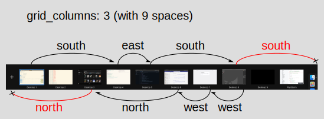

# yabai grid spaces

Grid space navigation (like [TotalSpaces2](https://totalspaces.binaryage.com/)) in
[yabai](https://github.com/koekeishiya/yabai).

## Installation

Install <https://github.com/mikkelricky/yabai/tree/grid-spaces> by running

```shell
brew install --HEAD mikkelricky/formulae/myabai
```

## Configuration

```shell
# Navigate a grid with 3 columns.
yabai --message config grid_columns 3
```



## Usage

```shell
yabai --message space --focus north
yabai --message space --focus east
yabai --message space --focus south
yabai --message space --focus west
```
